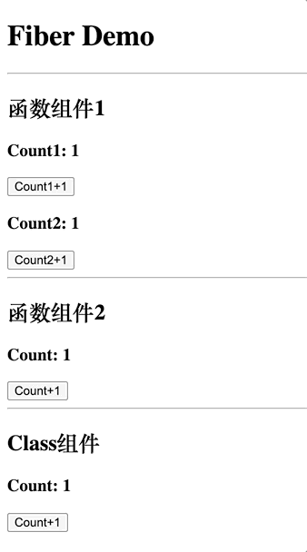
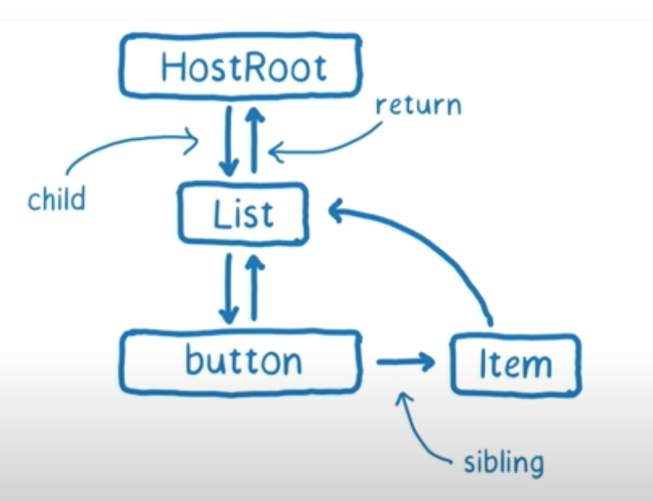
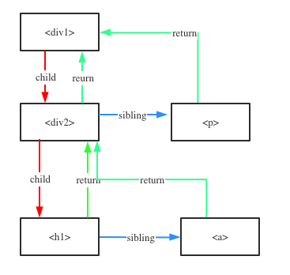
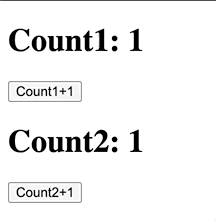

熟悉React的朋友都知道，React支持jsx语法，我们可以直接将HTML代码写到JS中间，然后渲染到页面上，我们写的HTML如果有更新的话，React还有虚拟DOM的对比，只更新变化的部分，而不重新渲染整个页面，大大提高渲染效率。到了16.x，React更是使用了一个被称为`Fiber`的架构，提升了用户体验，同时还引入了`hooks`等特性。那隐藏在React背后的原理是怎样的呢，`Fiber`和`hooks`又是怎么实现的呢？本文会从`jsx`入手，手写一个简易版的React，从而深入理解React的原理。

本文主要实现了这些功能:

> 简易版Fiber架构
>
> 简易版DIFF算法
>
> 简易版函数组件
>
> 简易版Hook: `useState`
>
> 娱乐版`Class`组件

本文程序跑起来效果如下：



## JSX和creatElement

以前我们写React要支持JSX还需要一个库叫`JSXTransformer.js`，后来JSX的转换工作都集成到了babel里面了，babel还提供了[在线预览的功能](https://babeljs.io/repl)，可以看到转换后的效果，比如下面这段简单的代码:

```jsx
const App =
(
  <div>
    <h1 id="title">Title</h1>
    <a href="xxx">Jump</a>
    <section>
      <p>
        Article
      </p>
    </section>
  </div>
);
```

经过babel转换后就变成了这样：


上面的截图可以看出我们写的HTML被转换成了`React.createElement`，我们将上面代码稍微格式化来看下：

```javascript
var App = React.createElement(
  'div',
  null,
  React.createElement(
    'h1',
    {
      id: 'title',
    },
    'Title',
  ),
  React.createElement(
    'a',
    {
      href: 'xxx',
    },
    'Jump',
  ),
  React.createElement(
    'section',
    null,
    React.createElement('p', null, 'Article'),
  ),
);
```

从转换后的代码我们可以看出`React.createElement`支持多个参数:

> 1. type，也就是节点类型
> 2. config, 这是节点上的属性，比如`id`和`href`
> 3. children, 从第三个参数开始就全部是children也就是子元素了，子元素可以有多个，类型可以是简单的文本，也可以还是`React.createElement`，如果是`React.createElement`，其实就是子节点了，子节点下面还可以有子节点。这样就用`React.createElement`的嵌套关系实现了HTML节点的树形结构。

让我们来完整看下这个简单的React页面代码：


渲染在页面上是这样：


这里面用到了React的地方其实就两个，一个是JSX，也就是`React.createElement`，另一个就是`ReactDOM.render`，所以我们手写的第一个目标就有了，就是`createElement`和`render`这两个方法。

### 手写createElement

对于`<h1 id="title">Title</h1>`这样一个简单的节点，原生DOM也会附加一大堆属性和方法在上面，所以我们在`createElement`的时候最好能将它转换为一种比较简单的数据结构，只包含我们需要的元素，比如这样：

```javascript
{
  type: 'h1',
  props: {
    id: 'title',
    children: 'Title'
  }
}
```

有了这个数据结构后，我们对于DOM的操作其实可以转化为对这个数据结构的操作，新老DOM的对比其实也可以转化为这个数据结构的对比，这样我们就不需要每次操作都去渲染页面，而是等到需要渲染的时候才将这个数据结构渲染到页面上。这其实就是虚拟DOM！而我们`createElement`就是负责来构建这个虚拟DOM的方法，下面我们来实现下：

```javascript
function createElement(type, props, ...children) {
  // 核心逻辑不复杂，将参数都塞到一个对象上返回就行
  // children也要放到props里面去，这样我们在组件里面就能通过this.props.children拿到子元素
  return {
    type,
    props: {
      ...props,
      children
    }
  }
}
```

上述代码是React的`createElement`简化版，对源码感兴趣的朋友可以看这里：[https://github.com/facebook/react/blob/60016c448bb7d19fc989acd05dda5aca2e124381/packages/react/src/ReactElement.js#L348](https://github.com/facebook/react/blob/60016c448bb7d19fc989acd05dda5aca2e124381/packages/react/src/ReactElement.js#L348)

### 手写render

上述代码我们用`createElement`将JSX代码转换成了虚拟DOM，那真正将它渲染到页面的函数是`render`，所以我们还需要实现下这个方法，通过我们一般的用法`ReactDOM.render( <App />,document.getElementById('root'));`可以知道他接收两个参数：

> 1. 根组件，其实是一个JSX组件，也就是一个`createElement`返回的虚拟DOM
> 2. 父节点，也就是我们要将这个虚拟DOM渲染的位置

有了这两个参数，我们来实现下`render`方法：

```javascript
function render(vDom, container) {
  let dom;
  // 检查当前节点是文本还是对象
  if(typeof vDom !== 'object') {
    dom = document.createTextNode(vDom)
  } else {
    dom = document.createElement(vDom.type);
  }

  // 将vDom上除了children外的属性都挂载到真正的DOM上去
  if(vDom.props) {
    Object.keys(vDom.props)
      .filter(key => key != 'children')
      .forEach(item => {
        dom[item] = vDom.props[item];
      })
  }
  
  // 如果还有子元素，递归调用
  if(vDom.props && vDom.props.children && vDom.props.children.length) {
    vDom.props.children.forEach(child => render(child, dom));
  }

  container.appendChild(dom);
}
```

上述代码是简化版的`render`方法，对源码感兴趣的朋友可以看这里：[https://github.com/facebook/react/blob/3e94bce765d355d74f6a60feb4addb6d196e3482/packages/react-dom/src/client/ReactDOMLegacy.js#L287](https://github.com/facebook/react/blob/3e94bce765d355d74f6a60feb4addb6d196e3482/packages/react-dom/src/client/ReactDOMLegacy.js#L287)

现在我们可以用自己写的`createElement`和`render`来替换原生的方法了：


可以得到一样的渲染结果：


## 为什么需要Fiber

上面我们简单的实现了虚拟DOM渲染到页面上的代码，这部分工作被React官方称为renderer，renderer是第三方可以自己实现的一个模块，还有个核心模块叫做reconciler，reconciler的一大功能就是大家熟知的diff，他会计算出应该更新哪些页面节点，然后将需要更新的节点虚拟DOM传递给renderer，renderer负责将这些节点渲染到页面上。但是这个流程有个问题，虽然React的diff算法是经过优化的，但是他却是同步的，renderer负责操作DOM的`appendChild`等API也是同步的，也就是说如果有大量节点需要更新，JS线程的运行时间可能会比较长，在这段时间浏览器是不会响应其他事件的，因为JS线程和GUI线程是互斥的，JS运行时页面就不会响应，这个时间太长了，用户就可能看到卡顿，特别是动画的卡顿会很明显。在[React的官方演讲](http://conf2017.reactjs.org/speakers/lin)中有个例子，可以很明显的看到这种同步计算造成的卡顿：


而Fiber就是用来解决这个问题的，Fiber可以将长时间的同步任务拆分成多个小任务，从而让浏览器能够抽身去响应其他事件，等他空了再回来继续计算，这样整个计算流程就显得平滑很多。下面是使用Fiber后的效果：


## 怎么来拆分

上面我们自己实现的`render`方法直接递归遍历了整个vDom树，如果我们在中途某一步停下来，下次再调用时其实并不知道上次在哪里停下来的，不知道从哪里开始，所以vDom的树形结构并不满足中途暂停，下次继续的需求，需要改造数据结构。另一个需要解决的问题是，拆分下来的小任务什么时候执行？我们的目的是让用户有更流畅的体验，所以我们最好不要阻塞高优先级的任务，比如用户输入，动画之类，等他们执行完了我们再计算。那我怎么知道现在有没有高优先级任务，浏览器是不是空闲呢？总结下来，Fiber要想达到目的，需要解决两个问题：

> 1. 新的任务调度，有高优先级任务的时候将浏览器让出来，等浏览器空了再继续执行
> 2. 新的数据结构，可以随时中断，下次进来可以接着执行

### requestIdleCallback

`requestIdleCallback`是一个实验中的新API，这个API调用方式如下:

```javascript
// 开启调用
var handle = window.requestIdleCallback(callback[, options])

// 结束调用
Window.cancelIdleCallback(handle) 
```

`requestIdleCallback`接收一个回调，这个回调会在浏览器空闲时调用，每次调用会传入一个`IdleDeadline`，可以拿到当前还空余多久，`options`可以传入参数最多等多久，等到了时间浏览器还不空就强制执行了。使用这个API可以解决任务调度的问题，让浏览器在空闲时才计算diff并渲染。[更多关于requestIdleCallback的使用可以查看MDN的文档。](https://developer.mozilla.org/zh-CN/docs/Web/API/Window/requestIdleCallback)但是这个API还在实验中，兼容性不好，[所以React官方自己实现了一套](https://github.com/facebook/react/blob/master/packages/scheduler/src/forks/SchedulerHostConfig.default.js)。本文会继续使用`requestIdleCallback`来进行任务调度，我们进行任务调度的思想是将任务拆分成多个小任务，`requestIdleCallback`里面不断的把小任务拿出来执行，当所有任务都执行完或者超时了就结束本次执行，同时要注册下次执行，代码架子就是这样：

```javascript
function workLoop(deadline) {
  while(nextUnitOfWork && deadline.timeRemaining() > 1) {
    // 这个while循环会在任务执行完或者时间到了的时候结束
    nextUnitOfWork = performUnitOfWork(nextUnitOfWork);
  }

  // 如果任务还没完，但是时间到了，我们需要继续注册requestIdleCallback
  requestIdleCallback(workLoop);
}

// performUnitOfWork用来执行任务，参数是我们的当前fiber任务，返回值是下一个任务
function performUnitOfWork(fiber) {
  
}
requestIdleCallback(workLoop);
```

[上述`workLoop`对应React源码看这里。](https://github.com/facebook/react/blob/4c7036e807fa18a3e21a5182983c7c0f05c5936e/packages/react-reconciler/src/ReactFiberWorkLoop.new.js#L1481)

### Fiber可中断数据结构

上面我们的`performUnitOfWork`并没有实现，但是从上面的结构可以看出来，他接收的参数是一个小任务，同时通过这个小任务还可以找到他的下一个小任务，Fiber构建的就是这样一个数据结构。Fiber之前的数据结构是一棵树，父节点的`children`指向了子节点，但是只有这一个指针是不能实现中断继续的。比如我现在有一个父节点A，A有三个子节点B,C,D，当我遍历到C的时候中断了，重新开始的时候，其实我是不知道C下面该执行哪个的，因为只知道C，并没有指针指向他的父节点，也没有指针指向他的兄弟。Fiber就是改造了这样一个结构，加上了指向父节点和兄弟节点的指针：



上面的图片还是来自于官方的演讲，可以看到和之前父节点指向所有子节点不同，这里有三个指针：

> 1. **child**: 父节点指向**第一个子元素**的指针。
> 2. **sibling**：从第一个子元素往后，指向下一个兄弟元素。
> 3. **return**：所有子元素都有的指向父元素的指针。

有了这几个指针后，我们可以在任意一个元素中断遍历并恢复，比如在上图`List`处中断了，恢复的时候可以通过`child`找到他的子元素，也可以通过`return`找到他的父元素，如果他还有兄弟节点也可以用`sibling`找到。Fiber这个结构外形看着还是棵树，但是没有了指向所有子元素的指针，父节点只指向第一个子节点，然后子节点有指向其他子节点的指针，这其实是个链表。

## 实现Fiber

现在我们可以自己来实现一下Fiber了，我们需要将之前的vDom结构转换为Fiber的数据结构，同时需要能够通过其中任意一个节点返回下一个节点，其实就是遍历这个链表。遍历的时候从根节点出发，先找子元素，如果子元素存在，直接返回，如果没有子元素了就找兄弟元素，找完所有的兄弟元素后再返回父元素，然后再找这个父元素的兄弟元素。整个遍历过程其实是个深度优先遍历，从上到下，然后最后一行开始从左到右遍历。比如下图从`div1`开始遍历的话，遍历的顺序就应该是`div1 -> div2 -> h1 -> a -> div2 -> p -> div1`。可以看到这个序列中，当我们`return`父节点时，这些父节点会被第二次遍历，所以我们写代码时，`return`的父节点不会作为下一个任务返回，只有`sibling`和`child`才会作为下一个任务返回。



```javascript
// performUnitOfWork用来执行任务，参数是我们的当前fiber任务，返回值是下一个任务
function performUnitOfWork(fiber) {
  // 根节点的dom就是container，如果没有这个属性，说明当前fiber不是根节点
  if(!fiber.dom) {
    fiber.dom = createDom(fiber);   // 创建一个DOM挂载上去
  } 

  // 如果有父节点，将当前节点挂载到父节点上
  if(fiber.return) {
    fiber.return.dom.appendChild(fiber.dom);
  }

  // 将我们前面的vDom结构转换为fiber结构
  const elements = fiber.children;
  let prevSibling = null;
  if(elements && elements.length) {
    for(let i = 0; i < elements.length; i++) {
      const element = elements[i];
      const newFiber = {
        type: element.type,
        props: element.props,
        return: fiber,
        dom: null
      }

      // 父级的child指向第一个子元素
      if(i === 0) {
        fiber.child = newFiber;
      } else {
        // 每个子元素拥有指向下一个子元素的指针
        prevSibling.sibling = newFiber;
      }

      prevSibling = fiber;
    }
  }

  // 这个函数的返回值是下一个任务，这其实是一个深度优先遍历
  // 先找子元素，没有子元素了就找兄弟元素
  // 兄弟元素也没有了就返回父元素
  // 然后再找这个父元素的兄弟元素
  // 最后到根节点结束
  // 这个遍历的顺序其实就是从上到下，从左到右
  if(fiber.child) {
    return fiber.child;
  }

  let nextFiber = fiber;
  while(nextFiber) {
    if(nextFiber.sibling) {
      return nextFiber.sibling;
    }

    nextFiber = nextFiber.return;
  }
}
```

[React源码中的`performUnitOfWork`看这里，当然比我们这个复杂很多。](https://github.com/facebook/react/blob/4c7036e807fa18a3e21a5182983c7c0f05c5936e/packages/react-reconciler/src/ReactFiberWorkLoop.new.js#L1541)

## 统一commit DOM操作

上面我们的`performUnitOfWork`一边构建Fiber结构一边操作DOM`appendChild`，这样如果某次更新好几个节点，操作了第一个节点之后就中断了，那我们可能只看到第一个节点渲染到了页面，后续几个节点等浏览器空了才陆续渲染。为了避免这种情况，我们应该将DOM操作都搜集起来，最后统一执行，这就是`commit`。为了能够记录位置，我们还需要一个全局变量`workInProgressRoot`来记录根节点，然后在`workLoop`检测如果任务执行完了，就`commit`:

```javascript
function workLoop(deadline) {
  while(nextUnitOfWork && deadline.timeRemaining() > 1) {
    // 这个while循环会在任务执行完或者时间到了的时候结束
    nextUnitOfWork = performUnitOfWork(nextUnitOfWork);
  }

  // 任务做完后统一渲染
  if(!nextUnitOfWork && workInProgressRoot) {
    commitRoot();
  }

  // 如果任务还没完，但是时间到了，我们需要继续注册requestIdleCallback
  requestIdleCallback(workLoop);
}
```

因为我们是在Fiber树完全构建后再执行的`commit`，而且有一个变量`workInProgressRoot`指向了Fiber的根节点，所以我们可以直接把`workInProgressRoot`拿过来递归渲染就行了：

```javascript
// 统一操作DOM
function commitRoot() {
  commitRootImpl(workInProgressRoot.child);    // 开启递归
  workInProgressRoot = null;     // 操作完后将workInProgressRoot重置
}

function commitRootImpl(fiber) {
  if(!fiber) {
    return;
  }

  const parentDom = fiber.return.dom;
  parentDom.appendChild(fiber.dom);

  // 递归操作子元素和兄弟元素
  commitRootImpl(fiber.child);
  commitRootImpl(fiber.sibling);
}
```

## reconcile调和

reconcile其实就是虚拟DOM树的diff操作，需要删除不需要的节点，更新修改过的节点，添加新的节点。为了在中断后能回到工作位置，我们还需要一个变量`currentRoot`，然后在`fiber`节点里面添加一个属性`alternate`，这个属性指向上一次运行的根节点，也就是`currentRoot`。`currentRoot`会在第一次`render`后的`commit`阶段赋值，也就是每次计算完后都会把当次状态记录在`alternate`上，后面更新了就可以把`alternate`拿出来跟新的状态做diff。然后`performUnitOfWork`里面需要添加调和子元素的代码，可以新增一个函数`reconcileChildren`。这个函数里面不能简单的创建新节点了，而是要将老节点跟新节点拿来对比，对比逻辑如下:

1. 如果新老节点类型一样，复用老节点DOM，更新props
2. 如果类型不一样，而且新的节点存在，创建新节点替换老节点
3. 如果类型不一样，没有新节点，有老节点，删除老节点

注意删除老节点的操作是直接将`oldFiber`加上一个删除标记就行，同时用一个全局变量`deletions`记录所有需要删除的节点：

```javascript
      // 对比oldFiber和当前element
      const sameType = oldFiber && element && oldFiber.type === element.type;  //检测类型是不是一样
      // 先比较元素类型
      if(sameType) {
        // 如果类型一样，复用节点，更新props
        newFiber = {
          type: oldFiber.type,
          props: element.props,
          dom: oldFiber.dom,
          return: workInProgressFiber,
          alternate: oldFiber,          // 记录下上次状态
          effectTag: 'UPDATE'           // 添加一个操作标记
        }
      } else if(!sameType && element) {
        // 如果类型不一样，有新的节点，创建新节点替换老节点
        newFiber = {
          type: element.type,
          props: element.props,
          dom: null,                    // 构建fiber时没有dom，下次perform这个节点是才创建dom
          return: workInProgressFiber,
          alternate: null,              // 新增的没有老状态
          effectTag: 'REPLACEMENT'      // 添加一个操作标记
        }
      } else if(!sameType && oldFiber) {
        // 如果类型不一样，没有新节点，有老节点，删除老节点
        oldFiber.effectTag = 'DELETION';   // 添加删除标记
        deletions.push(oldFiber);          // 一个数组收集所有需要删除的节点
      }
```

然后就是在`commit`阶段处理真正的DOM操作，具体的操作是根据我们的`effectTag`来判断的:

```javascript
function commitRootImpl(fiber) {
  if(!fiber) {
    return;
  }

  const parentDom = fiber.return.dom;
  if(fiber.effectTag === 'REPLACEMENT' && fiber.dom) {
    parentDom.appendChild(fiber.dom);
  } else if(fiber.effectTag === 'DELETION') {
    parentDom.removeChild(fiber.dom);
  } else if(fiber.effectTag === 'UPDATE' && fiber.dom) {
    // 更新DOM属性
    updateDom(fiber.dom, fiber.alternate.props, fiber.props);
  }

  // 递归操作子元素和兄弟元素
  commitRootImpl(fiber.child);
  commitRootImpl(fiber.sibling);
}
```

替换和删除的DOM操作都比较简单，更新属性的会稍微麻烦点，需要再写一个辅助函数`updateDom`来实现:

```javascript
// 更新DOM的操作
function updateDom(dom, prevProps, nextProps) {
  // 1. 过滤children属性
  // 2. 老的存在，新的没了，取消
  // 3. 新的存在，老的没有，新增
  Object.keys(prevProps)
    .filter(name => name !== 'children')
    .filter(name => !(name in nextProps))
    .forEach(name => {
      if(name.indexOf('on') === 0) {
        dom.removeEventListener(name.substr(2).toLowerCase(), prevProps[name], false);
      } else {
        dom[name] = '';
      }
    });

  Object.keys(nextProps)
    .filter(name => name !== 'children')
    .forEach(name => {
      if(name.indexOf('on') === 0) {
        dom.addEventListener(name.substr(2).toLowerCase(), nextProps[name], false);
      } else {
        dom[name] = nextProps[name];
      }
    });
}
```

`updateDom`的代码写的比较简单，事件只处理了简单的`on`开头的，兼容性也有问题，`prevProps`和`nextProps`可能会遍历到相同的属性，有重复赋值，但是总体原理还是没错的。要想把这个处理写全，代码量还是不少的。

## 函数组件

函数组件是React里面很常见的一种组件，我们前面的React架构其实已经写好了，我们这里来支持下函数组件。我们之前的`fiber`节点上的`type`都是DOM节点的类型，比如`h1`什么的，但是函数组件的节点`type`其实就是一个函数了，我们需要对这种节点进行单独处理。

首先需要在更新的时候检测当前节点是不是函数组件，如果是，`children`的处理逻辑会稍微不一样:

```javascript
// performUnitOfWork里面
// 检测函数组件
function performUnitOfWork(fiber) {
  const isFunctionComponent = fiber.type instanceof Function;
  if(isFunctionComponent) {
    updateFunctionComponent(fiber);
  } else {
    updateHostComponent(fiber);
  }
  
  // ...下面省略n行代码...
}

function updateFunctionComponent(fiber) {
  // 函数组件的type就是个函数，直接拿来执行可以获得DOM元素
  const children = [fiber.type(fiber.props)];

  reconcileChildren(fiber, elements);
}

// updateHostComponent就是之前的操作，只是单独抽取了一个方法
function updateHostComponent(fiber) {
  if(!fiber.dom) {
    fiber.dom = createDom(fiber);   // 创建一个DOM挂载上去
  } 

  // 将我们前面的vDom结构转换为fiber结构
  const elements = fiber.props.children;

  // 调和子元素
  reconcileChildren(fiber, elements);
}
```

然后在我们提交DOM操作的时候因为函数组件没有DOM元素，所以需要注意两点：

1. 获取父级DOM元素的时候需要递归网上找真正的DOM
2. 删除节点的时候需要递归往下找真正的节点

我们来修改下`commitRootImpl`:

```javascript
function commitRootImpl() {
  // const parentDom = fiber.return.dom;
  // 向上查找真正的DOM
  let parentFiber = fiber.return;
  while(!parentFiber.dom) {
    parentFiber = parentFiber.return;
  }
  const parentDom = parentFiber.dom;
  
  // ...这里省略n行代码...
  
  if{fiber.effectTag === 'DELETION'} {
    commitDeletion(fiber, parentDom);
  }
}

function commitDeletion(fiber, domParent) {
  if(fiber.dom) {
    // dom存在，是普通节点
    domParent.removeChild(fiber.dom);
  } else {
    // dom不存在，是函数组件,向下递归查找真实DOM
    commitDeletion(fiber.child, domParent);
  }
}
```

现在我们可以传入函数组件了:

```javascript
import React from './myReact';
const ReactDOM = React;

function App(props) {
  return (
    <div>
      <h1 id="title">{props.title}</h1>
      <a href="xxx">Jump</a>
      <section>
        <p>
          Article
        </p>
      </section>
    </div>
  );
}

ReactDOM.render(
  <App title="Fiber Demo"/>,
  document.getElementById('root')
);
```

## 实现useState 

`useState`是React Hooks里面的一个API，相当于之前`Class Component`里面的`state`，用来管理组件内部状态，现在我们已经有一个简化版的`React`了，我们也可以尝试下来实现这个API。

### 简单版

我们还是从用法入手来实现最简单的功能，我们一般使用`useState`是这样的：

```javascript
function App(props) {
  const [count, setCount] = React.useState(1);
  const onClickHandler = () => {
    setCount(count + 1);
  }
  return (
    <div>
      <h1>Count: {count}</h1>
      <button onClick={onClickHandler}>Count+1</button>
    </div>
  );
}

ReactDOM.render(
  <App title="Fiber Demo"/>,
  document.getElementById('root')
);
```

上述代码可以看出，我们的`useState`接收一个初始值，返回一个数组，里面有这个`state`的当前值和改变`state`的方法，需要注意的是`App`作为一个函数组件，每次`render`的时候都会运行，也就是说里面的局部变量每次`render`的时候都会重置，那我们的`state`就不能作为一个局部变量，而是应该作为一个全部变量存储：

```javascript
let state = null;
function useState(init) {

  state = state === null ? init : state;

  // 修改state的方法
  const setState = value => {
    state = value;

    // 只要修改了state，我们就需要重新处理节点
    workInProgressRoot = {
      dom: currentRoot.dom,
      props: currentRoot.props,
      alternate: currentRoot
    }

    // 修改nextUnitOfWork指向workInProgressRoot，这样下次就会处理这个节点了
    nextUnitOfWork = workInProgressRoot;
    deletions = [];
  }

  return [state, setState]
}
```

这样其实我们就可以使用了：


### 支持多个state

上面的代码只有一个`state`变量，如果我们有多个`useState`怎么办呢？为了能支持多个`useState`，我们的`state`就不能是一个简单的值了，我们可以考虑把他改成一个数组，多个`useState`按照调用顺序放进这个数组里面，访问的时候通过下标来访问:

```javascript
let state = [];
let hookIndex = 0;
function useState(init) {
  const currentIndex = hookIndex;
  state[currentIndex] = state[currentIndex] === undefined ? init : state[currentIndex];

  // 修改state的方法
  const setState = value => {
    state[currentIndex] = value;

    // 只要修改了state，我们就需要重新处理这个节点
    workInProgressRoot = {
      dom: currentRoot.dom,
      props: currentRoot.props,
      alternate: currentRoot
    }

    // 修改nextUnitOfWork指向workInProgressRoot，这样下次就会处理这个节点了
    nextUnitOfWork = workInProgressRoot;
    deletions = [];
  }

  hookIndex++;

  return [state[currentIndex], setState]
}
```

来看看多个`useState`的效果：



### 支持多个组件

上面的代码虽然我们支持了多个`useState`，但是仍然只有一套全局变量，如果有多个函数组件，每个组件都来操作这个全局变量，那相互之间不就是污染了数据了吗？所以我们数据还不能都存在全局变量上面，而是应该存在每个`fiber`节点上，处理这个节点的时候再将状态放到全局变量用来通讯:

```javascript
// 申明两个全局变量，用来处理useState
// wipFiber是当前的函数组件fiber节点
// hookIndex是当前函数组件内部useState状态计数
let wipFiber = null;
let hookIndex = null;
```

因为`useState`只在函数组件里面可以用，所以我们之前的`updateFunctionComponent`里面需要初始化处理`useState`变量:

```javascript
function updateFunctionComponent(fiber) {
  // 支持useState，初始化变量
  wipFiber = fiber;
  hookIndex = 0;
  wipFiber.hooks = [];        // hooks用来存储具体的state序列
  
  // ......下面代码省略......
}
```

因为`hooks`队列放到`fiber`节点上去了，所以我们在`useState`取之前的值时需要从`fiber.alternate`上取，完整代码如下：

```javascript
function useState(init) {
  // 取出上次的Hook
  const oldHook = wipFiber.alternate && wipFiber.alternate.hooks && wipFiber.alternate.hooks[hookIndex];

  // hook数据结构
  const hook = {
    state: oldHook ? oldHook.state : init      // state是每个具体的值
  }

  // 将所有useState调用按照顺序存到fiber节点上
  wipFiber.hooks.push(hook);
  hookIndex++;

  // 修改state的方法
  const setState = value => {
    hook.state = value;

    // 只要修改了state，我们就需要重新处理这个节点
    workInProgressRoot = {
      dom: currentRoot.dom,
      props: currentRoot.props,
      alternate: currentRoot
    }

    // 修改nextUnitOfWork指向workInProgressRoot，这样下次requestIdleCallback就会处理这个节点了
    nextUnitOfWork = workInProgressRoot;
    deletions = [];
  }

  return [hook.state, setState]
}
```

上面代码可以看出我们在将`useState`和存储的`state`进行匹配的时候是用的`useState`的调用顺序匹配`state`的下标，如果这个下标匹配不上了，`state`就错了，所以`React`里面不能出现这样的代码:

```javascript
if (something) {
    const [state, setState] = useState(1);
}
```

上述代码不能保证每次`something`都满足，可能导致`useState`这次`render`执行了，下次又没执行，这样新老节点的下标就匹配不上了，对于这种代码，`React`会直接报错：


## 用Hooks模拟Class组件

这个功能纯粹是娱乐性功能，通过前面实现的Hooks来模拟实现Class组件，这个并不是`React`官方的实现方式哈~我们可以写一个方法将Class组件转化为前面的函数组件:

```javascript
function transfer(Component) {
  return function(props) {
    const component = new Component(props);
    let [state, setState] = useState(component.state);
    component.props = props;
    component.state = state;
    component.setState = setState;

    return component.render();
  }
}
```

然后就可以写Class了，这个Class长得很像我们在React里面写的Class，有`state`,`setState`和`render`：

```javascript
import React from './myReact';

class Count4 {
  constructor(props) {
    this.props = props;
    this.state = {
      count: 1
    }
  }

  onClickHandler = () => {
    this.setState({
      count: this.state.count + 1
    })
  }

  render() {
    return (
      <div>
        <h3>Class component Count: {this.state.count}</h3>
        <button onClick={this.onClickHandler}>Count+1</button>
      </div>
    ); 
  }
}

// export的时候用transfer包装下
export default React.transfer(Count4);
```

然后使用的时候直接:

```javascript
<div>
  <Count4></Count4>
</div>
```

当然你也可以在`React`里面建一个空的`class Component`，让`Count4`继承他，这样就更像了。

## 总结

1. 我们写的JSX代码被babel转化成了`React.createElement`。
2. `React.createElement`返回的其实就是虚拟DOM结构。
3. `ReactDOM.render`方法是将虚拟DOM渲染到页面的。
4. 虚拟DOM的调和和渲染可以简单粗暴的递归，但是这个过程是同步的，如果需要处理的节点过多，可能会阻塞用户输入和动画播放，造成卡顿。
5. Fiber是16.x引入的新特性，用处是将同步的调和变成异步的。
6. Fiber改造了虚拟DOM的结构，具有`父 -> 第一个子`，`子 -> 兄`，`子 -> 父`这几个指针，有了这几个指针，可以从任意一个Fiber节点找到其他节点。
7. Fiber将整棵树的同步任务拆分成了每个节点可以单独执行的异步执行结构。
8. Fiber可以从任意一个节点开始遍历，遍历是深度优先遍历，顺序是`父 -> 子 -> 兄 -> 父`，也就是从上往下，从左往右。
9. Fiber的调和阶段可以是异步的小任务，但是提交阶段(`commit`)必须是同步的。因为异步的`commit`可能让用户看到节点一个一个接连出现，体验不好。
10. 函数组件其实就是这个节点的`type`是个函数，直接将`type`拿来运行就可以得到虚拟DOM。
11. `useState`是在Fiber节点上添加了一个数组，数组里面的每个值对应了一个`useState`，`useState`调用顺序必须和这个数组下标匹配，不然会报错。

## 参考资料

[A Cartoon Intro to Fiber](http://conf2017.reactjs.org/speakers/lin)

[妙味课堂大圣老师：手写react的fiber和hooks架构](https://study.miaov.com/v_show/4227)

[React Fiber](https://juejin.im/post/5ab7b3a2f265da2378403e57)

[这可能是最通俗的 React Fiber(时间分片) 打开方式](https://juejin.im/post/5dadc6045188255a270a0f85)

[浅析 React Fiber](https://juejin.im/post/5be969656fb9a049ad76931f)

[React Fiber架构](https://zhuanlan.zhihu.com/p/37095662)

