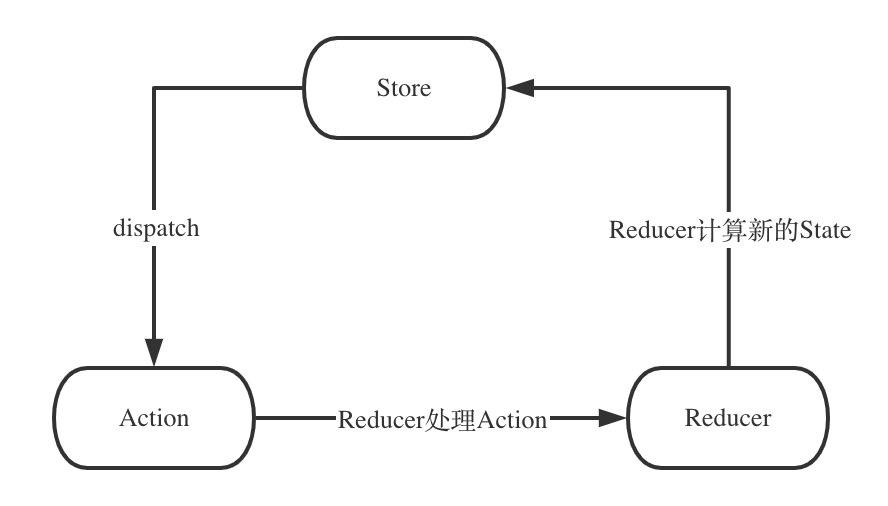
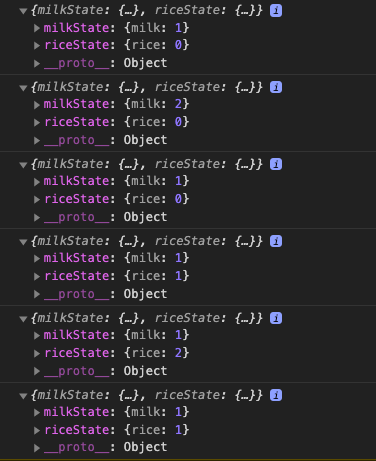

Redux可是一个大名鼎鼎的库，很多地方都在用，我也用了几年了，今天这篇文章就是自己来实现一个Redux，以便于深入理解他的原理。我们还是老套路，从基本的用法入手，然后自己实现一个Redux来替代源码的NPM包，但是功能保持不变。本文只会实现Redux的核心库，跟其他库的配合使用，比如React-Redux准备后面单独写一篇文章来讲。有时候我们过于关注使用，只记住了各种使用方式，反而忽略了他们的核心原理，但是如果我们想真正的提高技术，最好还是一个一个搞清楚，比如Redux和React-Redux看起来很像，但是他们的核心理念和关注点是不同的，Redux其实只是一个单纯状态管理库，没有任何界面相关的东西，React-Redux关注的是怎么将Redux跟React结合起来，用到了一些React的API。

## 基本概念

Redux的概念有很多文章都讲过，想必大家都看过很多了，我这里不再展开，只是简单提一下。Redux基本概念主要有以下几个：

### Store

人如其名，Store就是一个仓库，它存储了所有的状态(State)，还提供了一些操作他的API，我们后续的操作其实都是在操作这个仓库。假如我们的仓库是用来放牛奶的，初始情况下，我们的仓库里面一箱牛奶都没有，那Store的状态(State)就是：

```json
{
	milk: 0
}
```

### Actions

一个Action就是一个动作，这个动作的目的是更改Store中的某个状态，Store还是上面的那个仓库，现在我想往仓库放一箱牛奶，那"我想往仓库放一箱牛奶"就是一个Action，代码就是这样：

```javascript
{
  type: "PUT_MILK",
  count: 1
}
```

###  Reducers

前面"我想往仓库放一箱牛奶"只是想了，还没操作，具体操作要靠Reducer，Reducer就是根据接收的Action来改变Store中的状态，比如我接收了一个`PUT_MILK`，同时数量`count`是1，那放进去的结果就是`milk`增加了1，从0变成了1，代码就是这样:

```javascript
const initState = {
  milk: 0
}

function reducer(state = initState, action) {
  switch (action.type) {
    case 'PUT_MILK':
      return {...state, milk: state.milk + action.count}
    default:
      return state
  }
}
```

可以看到Redux本身就是一个单纯的状态机，Store存放了所有的状态，Action是一个改变状态的通知，Reducer接收到通知就更改Store中对应的状态。

## 简单例子

下面我们来看一个简单的例子，包含了前面提到的Store，Action和Reducer这几个概念：

```javascript
import { createStore } from 'redux';

const initState = {
  milk: 0
};

function reducer(state = initState, action) {
  switch (action.type) {
    case 'PUT_MILK':
      return {...state, milk: state.milk + action.count};
    case 'TAKE_MILK':
      return {...state, milk: state.milk - action.count};
    default:
      return state;
  }
}

let store = createStore(reducer);

// subscribe其实就是订阅store的变化，一旦store发生了变化，传入的回调函数就会被调用
// 如果是结合页面更新，更新的操作就是在这里执行
store.subscribe(() => console.log(store.getState()));

// 将action发出去要用dispatch
store.dispatch({ type: 'PUT_MILK' });    // milk: 1
store.dispatch({ type: 'PUT_MILK' });    // milk: 2
store.dispatch({ type: 'TAKE_MILK' });   // milk: 1
```

## 自己实现

前面我们那个例子虽然短小，但是已经包含了Redux的核心功能了，所以我们手写的第一个目标就是替换这个例子中的Redux。要替换这个Redux，我们得先知道他里面都有什么东西，仔细一看，我们好像只用到了他的一个API:

> `createStore`：这个API接受`reducer`方法作为参数，返回一个`store`，主要功能都在这个`store`上。

看看`store`上我们都用到了啥：

> `store.subscribe`: 订阅`state`的变化，当`state`变化的时候执行回调，可以有多个`subscribe`，里面的回调会依次执行。
>
> `store.dispatch`: 发出`action`的方法，每次`dispatch` `action`都会执行`reducer`生成新的`state`，然后执行`subscribe`注册的回调。
>
> `store.getState`:一个简单的方法，返回当前的`state`。

看到`subscribe`注册回调，`dispatch`触发回调，想到了什么，这不就是发布订阅模式吗？[我之前有一篇文章详细讲过发布订阅模式了，这里直接仿写一个。](https://juejin.im/post/5e7978485188255e237c2a29)

```javascript
function createStore() {
  let state;              // state记录所有状态
  let listeners = [];     // 保存所有注册的回调

  function subscribe(callback) {
    listeners.push(callback);       // subscribe就是将回调保存下来
  }

  // dispatch就是将所有的回调拿出来依次执行就行
  function dispatch() {
    for (let i = 0; i < listeners.length; i++) {
      const listener = listeners[i];
      listener();
    }
  }

  // getState直接返回state
  function getState() {
    return state;
  }

  // store包装一下前面的方法直接返回
  const store = {
    subscribe,
    dispatch,
    getState
  }

  return store;
}
```

上述代码是不是很简单嘛，Redux核心也是一个发布订阅模式，就是这么简单！等等，好像漏了啥，`reducer`呢？`reducer`的作用是在发布事件的时候改变`state`，所以我们的`dispatch`在执行回调前应该先执行`reducer`,用`reducer`的返回值重新给`state`赋值，`dispatch`改写如下:

```javascript
function dispatch(action) {
  state = reducer(state, action);

  for (let i = 0; i < listeners.length; i++) {
    const listener = listeners[i];
    listener();
  }
}
```

到这里，前面例子用到的所有API我们都自己实现了，我们用自己的Redux来替换下官方的Redux试试：

```javascript
// import { createStore } from 'redux';
import { createStore } from './myRedux';
```

可以看到输出结果是一样的，说明我们自己写的Redux没有问题：


了解了Redux的核心原理，我们再去看他的源码应该就没有问题了，[createStore的源码传送门。](https://github.com/reduxjs/redux/blob/master/src/createStore.ts)

最后我们再来梳理下Redux的核心流程，注意单纯的Redux只是个状态机，是没有`View`层的哦。

 

除了这个核心逻辑外，Redux里面还有些API也很有意思，我们也来手写下。

## 手写`combineReducers`

`combineReducers`也是使用非常广泛的API，当我们应用越来越复杂，如果将所有逻辑都写在一个`reducer`里面，最终这个文件可能会有成千上万行，所以Redux提供了`combineReducers`，可以让我们为不同的模块写自己的`reducer`，最终将他们组合起来。比如我们最开始那个牛奶仓库，由于我们的业务发展很好，我们又增加了一个放大米的仓库，我们可以为这两个仓库创建自己的`reducer`，然后将他们组合起来，使用方法如下：

```javascript
import { createStore, combineReducers } from 'redux';

const initMilkState = {
  milk: 0
};
function milkReducer(state = initMilkState, action) {
  switch (action.type) {
    case 'PUT_MILK':
      return {...state, milk: state.milk + action.count};
    case 'TAKE_MILK':
      return {...state, milk: state.milk - action.count};
    default:
      return state;
  }
}

const initRiceState = {
  rice: 0
};
function riceReducer(state = initRiceState, action) {
  switch (action.type) {
    case 'PUT_RICE':
      return {...state, rice: state.rice + action.count};
    case 'TAKE_RICE':
      return {...state, rice: state.rice - action.count};
    default:
      return state;
  }
}

// 使用combineReducers组合两个reducer
const reducer = combineReducers({milkState: milkReducer, riceState: riceReducer});

let store = createStore(reducer);

store.subscribe(() => console.log(store.getState()));

// 操作🥛的action
store.dispatch({ type: 'PUT_MILK', count: 1 });    // milk: 1
store.dispatch({ type: 'PUT_MILK', count: 1 });    // milk: 2
store.dispatch({ type: 'TAKE_MILK', count: 1 });   // milk: 1

// 操作大米的action
store.dispatch({ type: 'PUT_RICE', count: 1 });    // rice: 1
store.dispatch({ type: 'PUT_RICE', count: 1 });    // rice: 2
store.dispatch({ type: 'TAKE_RICE', count: 1 });   // rice: 1
```

上面代码我们将大的`state`分成了两个小的`milkState`和`riceState`，最终运行结果如下：



知道了用法，我们尝试自己来写下呢！要手写`combineReducers`，我们先来分析下他干了啥，首先它的返回值是一个`reducer`，这个`reducer`同样会作为`createStore`的参数传进去，说明这个返回值是一个跟我们之前普通`reducer`结构一样的函数。这个函数同样接收`state`和`action`然后返回新的`state`，只是这个新的`state`要符合`combineReducers`参数的数据结构。我们尝试来写下：

```javascript
function combineReducers(reducerMap) {
  const reducerKeys = Object.keys(reducerMap);    // 先把参数里面所有的键值拿出来
  
  // 返回值是一个普通结构的reducer函数
  const reducer = (state = {}, action) => {
    const newState = {};
    
    for(let i = 0; i < reducerKeys.length; i++) {
      // reducerMap里面每个键的值都是一个reducer，我们把它拿出来运行下就可以得到对应键新的state值
      // 然后将所有reducer返回的state按照参数里面的key组装好
      // 最后再返回组装好的newState就行
      const key = reducerKeys[i];
      const currentReducer = reducerMap[key];
      const prevState = state[key];
      newState[key] = currentReducer(prevState, action);
    }
    
    return newState;
  };
  
  return reducer;
}
```

[官方源码的实现原理跟我们的一样，只是他有更多的错误处理，大家可以对照着看下。](https://github.com/reduxjs/redux/blob/master/src/combineReducers.ts#L139)

## 手写`applyMiddleware`

`middleware`是Redux里面很重要的一个概念，Redux的生态主要靠这个API接入，比如我们想写一个`logger`的中间件可以这样写(这个中间件来自于官方文档)：

```javascript
// logger是一个中间件，注意返回值嵌了好几层函数
// 我们后面来看看为什么这么设计
function logger(store) {
  return function(next) {
    return function(action) {
      console.group(action.type);
      console.info('dispatching', action);
      let result = next(action);
      console.log('next state', store.getState());
      console.groupEnd();
      return result
    }
  }
}

// 在createStore的时候将applyMiddleware作为第二个参数传进去
const store = createStore(
  reducer,
  applyMiddleware(logger)
)
```

可以看到上述代码为了支持中间件，`createStore`支持了第二个参数，这个参数官方称为`enhancer`，顾名思义他是一个增强器，用来增强`store`的能力的。官方对于`enhancer`的定义如下：

```javascript
type StoreEnhancer = (next: StoreCreator) => StoreCreator
```

上面的结构的意思是说`enhancer`作为一个函数，他接收`StoreCreator`函数作为参数，同时返回的也必须是一个`StoreCreator`函数。注意他的返回值也是一个`StoreCreator`函数，也就是我们把他的返回值拿出来继续执行应该得到跟之前的`createStore`一样的返回结构，也就是说我们之前的`createStore`返回啥结构，他也必须返回结构，也就是这个`store`：

```json
{
  subscribe,
  dispatch,
  getState
}
```

### `createStore`支持`enhancer`

根据他关于`enhancer`的定义，我们来改写下自己的`createStore`，让他支持`enhancer`：

```javascript
function createStore(reducer, enhancer) {   // 接收第二个参数enhancer
  // 先处理enhancer
  // 如果enhancer存在并且是函数
  // 我们将createStore作为参数传给他
  // 他应该返回一个新的createStore给我
  // 我再拿这个新的createStore执行，应该得到一个store
  // 直接返回这个store就行
  if(enhancer && typeof enhancer === 'function'){
    const newCreateStore = enhancer(createStore);
    const newStore = newCreateStore(reducer);
    return newStore;
  }
  
  // 如果没有enhancer或者enhancer不是函数，直接执行之前的逻辑
  // 下面这些代码都是之前那版
  // 省略n行代码
	// .......
  const store = {
    subscribe,
    dispatch,
    getState
  }

  return store;
}
```

[这部分对应的源码看这里。](https://github.com/reduxjs/redux/blob/master/src/createStore.ts#L91)

### `applyMiddleware`返回值是一个`enhancer`

前面我们已经有了`enhancer`的基本结构，`applyMiddleware`是作为第二个参数传给`createStore`的，也就是说他是一个`enhancer`，准确的说是`applyMiddleware`的返回值是一个`enhancer`，因为我们传给`createStore`的是他的执行结果`applyMiddleware()`：

```javascript
function applyMiddleware(middleware) {
  // applyMiddleware的返回值应该是一个enhancer
  // 按照我们前面说的enhancer的参数是createStore
  function enhancer(createStore) {
    // enhancer应该返回一个新的createStore
    function newCreateStore(reducer) {
      // 我们先写个空的newCreateStore，直接返回createStore的结果
      const store = createStore(reducer);
      return store
    }
    
    return newCreateStore;
  }
  
  return enhancer;
}
```

### 实现`applyMiddleware`

上面我们已经有了`applyMiddleware`的基本结构了，但是功能还没实现，要实现他的功能，我们必须先搞清楚一个中间件到底有什么功能，还是以前面的`logger`中间件为例：

```javascript
function logger(store) {
  return function(next) {
    return function(action) {
      console.group(action.type);
      console.info('dispatching', action);
      let result = next(action);
      console.log('next state', store.getState());
      console.groupEnd();
      return result
    }
  }
}
```

这个中间件运行效果如下:


可以看到我们`let result = next(action);`这行执行之后`state`改变了，前面我们说了要改变`state`只能`dispatch(action)`，所以这里的`next(action)`就是`dispatch(action)`，只是换了一个名字而已。而且注意最后一层返回值`return function(action)`的结构，他的参数是`action`，是不是很像`dispatch(action)`，其实他就是一个新的`dispatch(action)`，这个新的`dispatch(action)`会调用原始的`dispatch`，并且在调用的前后加上自己的逻辑。所以到这里一个中间件的结构也清楚了：

> 1. 一个中间件接收`store`作为参数，会返回一个函数
> 2. 返回的这个函数接收老的`dispatch`函数作为参数，会返回一个新的函数
> 3. 返回的新函数就是新的`dispatch`函数，这个函数里面可以拿到外面两层传进来的`store`和老`dispatch`函数

所以说白了，中间件就是加强`dispatch`的功能，用新的`dispatch`替换老的`dispatch`，这不就是个装饰者模式吗？其实前面`enhancer`也是一个装饰者模式，传入一个`createStore`，在`createStore`执行前后加上些代码，最后又返回一个增强版的`createStore`。[可见设计模式在这些优秀的框架中还真是广泛存在，如果你对装饰者模式还不太熟悉，可以看我之前这篇文章。](https://juejin.im/post/5ed0a2286fb9a047e02ef121#heading-8)

遵循这个思路，我们的`applyMiddleware`就可以写出来了：

```javascript
// 直接把前面的结构拿过来
function applyMiddleware(middleware) {
  function enhancer(createStore) {
    function newCreateStore(reducer) {
      const store = createStore(reducer);
      
      // 将middleware拿过来执行下，传入store
      // 得到第一层函数
      const func = middleware(store);
      
      // 解构出原始的dispatch
      const { dispatch } = store;
      
      // 将原始的dispatch函数传给func执行
      // 得到增强版的dispatch
      const newDispatch = func(dispatch);
      
      // 返回的时候用增强版的newDispatch替换原始的dispatch
      return {...store, dispatch: newDispatch}
    }
    
    return newCreateStore;
  }
  
  return enhancer;
}
```

照例用我们自己的`applyMiddleware`替换老的，跑起来是一样的效果，说明我们写的没问题，哈哈~


### 支持多个`middleware`

我们的`applyMiddleware`还差一个功能，就是支持多个`middleware`，比如像这样:

```javascript
applyMiddleware(
  rafScheduler,
  timeoutScheduler,
  thunk,
  vanillaPromise,
  readyStatePromise,
  logger,
  crashReporter
)
```

其实要支持这个也简单，我们返回的`newDispatch`里面依次的将传入的`middleware`拿出来执行就行，多个函数的串行执行可以使用辅助函数`compose`，这个函数定义如下。只是需要注意的是我们这里的`compose`不能把方法拿来执行就完了，应该返回一个包裹了所有方法的方法。

```javascript
function compose(...func){
  return funcs.reduce((a, b) => (...args) => a(b(...args)));
}
```

这个`compose`可能比较让人困惑，我这里还是讲解下，比如我们有三个函数，这三个函数都是我们前面接收`dispatch`返回新`dispatch`的方法：

```javascript
const fun1 = dispatch => newDispatch1;
const fun2 = dispatch => newDispatch2;
const fun3 = dispatch => newDispatch3;
```

当我们使用了`compose(fun1, fun2, fun3)`后执行顺序是什么样的呢？

```javascript
// 第一次其实执行的是
(func1, func2) => (...args) => func1(fun2(...args))
// 这次执行完的返回值是下面这个，用个变量存起来吧
const temp = (...args) => func1(fun2(...args))

// 我们下次再循环的时候其实执行的是
(temp, func3) => (...args) => temp(func3(...args));
// 这个返回值是下面这个，也就是最终的返回值，其实就是从func3开始从右往左执行完了所有函数
// 前面的返回值会作为后面参数
(...args) => temp(func3(...args));

// 再看看上面这个方法，如果把dispatch作为参数传进去会是什么效果
(dispatch) => temp(func3(dispatch));

// 然后func3(dispatch)返回的是newDispatch3，这个又传给了temp(newDispatch3)，也就是下面这个会执行
(newDispatch3) => func1(fun2(newDispatch3))

// 上面这个里面用newDispatch3执行fun2(newDispatch3)会得到newDispatch2
// 然后func1(newDispatch2)会得到newDispatch1
// 注意这时候的newDispatch1其实已经包含了newDispatch3和newDispatch2的逻辑了，将它拿出来执行这三个方法就都执行了
```

[更多关于compose原理的细节可以看我之前这篇文章。](https://juejin.im/post/5e3ff92be51d4526f16e3b90)

所以我们支持多个`middleware`的代码就是这样:

```javascript
// 参数支持多个中间件
function applyMiddleware(...middlewares) {
  function enhancer(createStore) {
    function newCreateStore(reducer) {
      const store = createStore(reducer);
      
      // 多个middleware，先解构出dispatch => newDispatch的结构
      const chain = middlewares.map(middleware => middleware(store));
      const { dispatch } = store;
      
      // 用compose得到一个组合了所有newDispatch的函数
      const newDispatchGen = compose(...chain);
      // 执行这个函数得到newDispatch
      const newDispatch = newDispatchGen(dispatch);

      return {...store, dispatch: newDispatch}
    }
    
    return newCreateStore;
  }
  
  return enhancer;
}
```

最后我们再加一个`logger2`中间件实现效果:

```javascript
function logger2(store) {
  return function(next) {
    return function(action) {
      let result = next(action);
      console.log('logger2');
      return result
    }
  }
}

let store = createStore(reducer, applyMiddleware(logger, logger2));
```

可以看到`logger2`也已经打印出来了，大功告成。


现在我们也可以知道他的中间件为什么要包裹几层函数了：

> 第一层：目的是传入`store`参数
>
> 第二层：第二层的结构是`dispatch => newDispatch`，多个中间件的这层函数可以`compose`起来，形成一个大的`dispatch => newDispatch`
>
> 第三层：这层就是最终的返回值了，其实就是`newDispatch`，是增强过的`dispatch`，是中间件的真正逻辑所在。

到这里我们的`applyMiddleware`就写完了，[对应的源码可以看这里，相信看了本文再去看源码就没啥问题了！](https://github.com/reduxjs/redux/blob/master/src/applyMiddleware.ts#L55)

## 总结

1. 单纯的Redux只是一个状态机，`store`里面存了所有的状态`state`，要改变里面的状态`state`，只能`dispatch action`。
2. 对于发出来的`action`需要用`reducer`来处理，`reducer`会计算新的`state`来替代老的`state`。
3. `subscribe`方法可以注册回调方法，当`dispatch action`的时候会执行里面的回调。
4. Redux其实就是一个发布订阅模式！
5. Redux还支持`enhancer`，`enhancer`其实就是一个装饰者模式，传入当前的`createStore`，返回一个增强的`createStore`。
6. Redux使用`applyMiddleware`支持中间件，`applyMiddleware`的返回值其实就是一个`enhancer`。
7. Redux的中间件也是一个装饰者模式，传入当前的`dispatch`，返回一个增强了的`dispatch`。
8. 单纯的Redux是没有View层的，所以他可以跟各种UI库结合使用，比如`react-redux`，计划下一篇文章就是手写`react-redux`。

## 参考资料

官方文档：[https://redux.js.org/](https://redux.js.org/)

GitHub源码：[https://github.com/reduxjs/redux](https://github.com/reduxjs/redux)